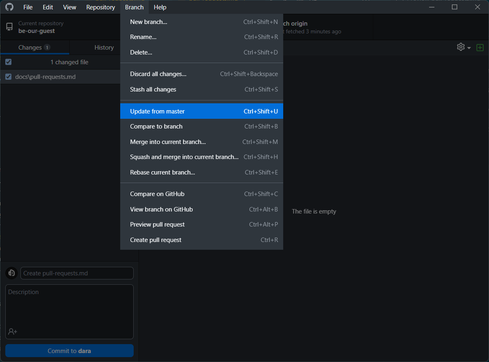

# Pull requests

Create a pull request

Review the files for conflicts

If there are no conflicts, merge the pull request

If there are conflicts, resolve them and merge the pull request

Back on your local machine open github desktop

Fetch changes

Choose repository update from master 

